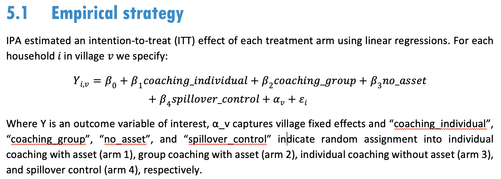
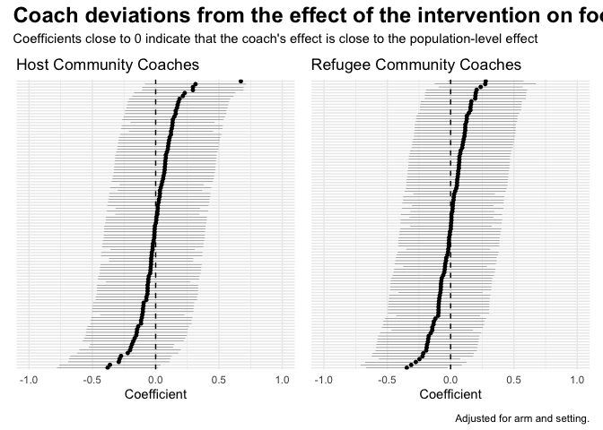
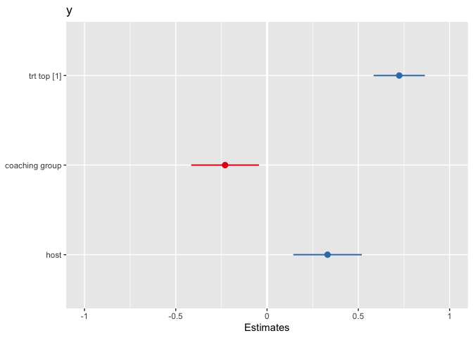
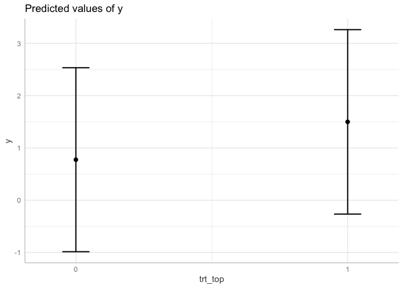

Coach Effect Simulation
================

# Introduction

AVSI is interested in further exploring why coaching matters and how
coaches make a difference in the lives of program participants. AVSI’s
key learning objective with respect to coaching is to answer the
following questions:

1.  In what ways is coaching important for achieving the goals of G2R?
2.  What are the characteristics and practices of highly effective
    coaches?
3.  What is the role of training, supervision, and support in the
    coaching model, and how can the program improve the capacity and
    effectiveness of coaches?

These questions have clear parallels with the literature on therapist
effects in psychotherapy research. Therapist effects are defined as:

> The contribution that can be attributed to therapists when evaluating
> the efficacy of a psychological intervention.

Estimated by multilevel models, therapist effects are typically
represented as a percentage of the outcome variability due to
therapists. We would like to estimate the ‘coach effect’ in the G2R
model.

We propose to conduct a secondary analysis of the Cohort 1 data to
estimate what percentage of variability in outcomes can be attributed to
coaches. A possible limitation of this analysis is that the coach
randomization was broken, but the extent to which AVSI had to deviate
from the orignial assignments is not yet clear (to us at least). At a
minimum, this analysis will generate new hypotheses about the influence
of coaches in a setting that has very little (if any) empirical work.

# Design

In Cohort 1, village clusters were randomly assigned to treatment or
control in each strata (host and refugee communities). Eligible
households in each treatment village were then randomly assigned to
groups of 25 households, and these groups were randomly assigned to 1 of
4 unmarked bins. A public lottery was held to assign bins to study arms.

Separately, coaches were randomly assigned to be individual or group
coaches. Individual coaches were randomly assigned to a group of 25
households in study arms 1 or 3 (individual coaching), whereas group
coaches were each randomly assigned to 5 groups of 25 households in
study arm 2 (group coaching). The households assigned to arm 4 were in
the spillover control and did not receive the program.

<!-- -->

This design represents two levels of partial nesting:

1.  Treatment households were nested in groups.
2.  Groups were nested in coaches (also treatment only).

The nesting is **partial** because control households did not have
coaches or groups. Additionally, groups were nested in village clusters
but coaches were not (i.e., coaches could work with groups from
different village clusters). Therefore, the design also has **crossed**
random effects.

# Data Simulation

We do not have access to the data, so to illustrate a proposed approach
we must first simulate trial data.

``` r
# load the necessary packages
  library(tidyverse)
  library(lme4)
  library(broom.mixed)
  library(broom.helpers)
  library(brms)
  library(cmdstanr)
  library(tidybayes)
  library(sjPlot)
  library(specr)
  library(patchwork)
  library(modelbased)

  options("cmdstanr_write_stan_file_dir" = "cmdstanr")
```

## Model

### Simple

John and David suggested the following Stata code for a simplified model
of villages assigned to treatment or control and random effects for
villages and coaches.

    mixed y trt || _all:R.village || coach:trt, nocons reml

> This tells Stata that the village random effect is crossed with the
> coach random effect, and that the coach random effect is only in the
> treatment arm.

Coaches are partially nested, so John and David followed the approach of
[Candlish et
al. (2018)](https://bmcmedresmethodol.biomedcentral.com/articles/10.1186/s12874-018-0559-x)
to code the partially nested clusters as ‘singleton’ clusters and (I
think) fit a partially nested homoscedastic mixed effects model.

I believe the same model in `{lme4}` would be:

    lmer(y ~ trt + (1 | village) + (0 + trt | coach))

where `trt` is an indicator of assignment to any treatment arm,
`village` is the village code, and `coach` is the coach code.
Individuals in the control arm have unique, singleton, codes for coaches
since they did not have a coach.

### Actual

The actual study design was more complicated. Households in villages
assigned to treatment were assigned to groups of 25, and these groups
were assigned to 1 of 3 treatment arms or a spillover control arm.

IPA estimated the following model (coefficient names changed to match
this simulation):

<!-- -->

A few things to note about the IPA strategy:

1.  They entered village as a fixed effect, not a random effect.
2.  They accounted for the multilevel nature of the design with
    bootstrapping.
3.  They did not include setting (host/refugee) in the model.

> To account for the two levels of randomization — village level
> randomization into treatment and control and household-level
> randomization into experimental arms within treatment villages — we
> construct standard errors of the parameter estimates of interest by
> using a bootstrap procedure that mirrors the two stages randomization
> process at the two different levels.

We propose to fit a mixed model and incorporate information about
setting as a fixed effect:

    lmer(y ~ coaching_individual +  # assigned to arm 1
             coaching_group +       # assigned to arm 2
             no_asset +             # assigned to arm 3
             spillover_control +    # assigned to arm 4 (no program)
             host +                 # village is in a host community (vs refugee)
             (1 | village) + 
             (0 + trt | coach) +    # trt is arm 1, 2, or 3; coaches only in trt 
             (0 + trt | group))     # all trt had some element of group structure
                                    #   only coaching_group had group coaching
                                    #   but arms 1 and 3 had group program elements

## Function

We start by defining a function that simulates the data and fits the
model.

``` r
#' Simulate data
#' @param seed
#' @param action simulate "data only" or "fit" (sim and fit)
#' @param method "lmer" or "brm"
#' @param ci interval width
#' @param n_village_t0 participants per village, control
#' @param n_group participants per group
#' @param group_village_t1 groups per village, treatment
#' @param k_villages number of villages
#' @param village_rho village ICC
#' @param coach_rho coach ICC
#' @param coach_group_rho ICC for same coach & group; since groups are nested in coaches, the ICC for group (coach_group_rho) is the ICC for observations sharing the same coach and the same group, so must be equal to or greater than the ICC for coach alone (coach_rho)
#' @param variance_total_trt total variance
#' @param b_0 mean in pure control
#' @param b_ind_asset impact of individual coaching with asset transfer
#' @param b_group impact of group coaching with asset transfer
#' @param b_ind_noasset impact of individual coaching without asset transfer
#' @param b_spill spillover from T households to C households in T villages
#' @param b_host impact of host community setting (vs refugee)

  simfit <- function(seed,
                     action = "data only",
                     method = "lmer",
                     ci = 0.89,
                     k_villages,
                     n_village_t0,
                     group_village_t1,
                     n_group,
                     village_rho, 
                     coach_rho,
                     coach_group_rho,
                     variance_total_trt,
                     b_0,
                     b_ind_asset,
                     b_group,
                     b_ind_noasset,
                     b_spill,
                     b_host,
                     ... # helps the function work with pmap() 
                     ) {
    
# simulate data -----------------------------------------------------
  set.seed(seed)
  
  n1 <- (k_villages/2)*group_village_t1*n_group
  n0 <- (k_villages/2)*n_village_t0
  ntot <- n0 + n1
  
# different id for each observation
  id <- 1:(n1+n0) 
  
# village t/c assignment indicator
  village_trt <- c(rep(1, n1), rep(0, n0)) 
  
# village indicator
  villages_t1 <- rep(1:(k_villages/2), each = group_village_t1*n_group)
  villages_t0 <- rep(((k_villages/2)+1):k_villages, each = n_village_t0)
  village <- paste("v", c(villages_t1, villages_t0), sep="_")
  
# group indicator for treatment villages, singleton groups in control villages
# need to add singleton groups for spillover control hhs in later step
  group <- paste("g",
                 c(rep(1:((k_villages/2)*group_village_t1), each = n_group),
                   (n1+1):(n1+n0)),
                 sep="_")

# combine
  df <- tibble(id = id,
               village = village,
               village_trt = village_trt,
               group = group) 
  
# add strata
  strata <- df %>%
    select(village, village_trt) %>%
    distinct(village, .keep_all = TRUE) %>%
    group_by(village_trt) %>%
    mutate(host = c(rep(1, n()%/%2),
                    rep(0, (n()%/%2) + n()%%2)))
  
  df <- df %>%
    left_join(strata) 
   
# arm indicator
  arm <- df %>%
    filter(village_trt==1) %>%
    select(village, group, host) %>%
    distinct(village, group, .keep_all = TRUE) %>%
    group_by(host) %>%
    mutate(arm = c(rep(1, n()%/%4),
                   rep(2, n()%/%4),
                   rep(3, n()%/%4),
                   rep(4, (n()%/%4) + (n()%%4)))) %>%
    ungroup() %>%
    select(village, group, arm)
  
  df <- df %>%
    left_join(arm) %>%
    mutate(arm = case_when(
      village_trt == 0 ~ 0,
      TRUE ~ arm
    ))
    
# individual t/c indicator
  df <- df %>%
    mutate(trt = case_when(
      village_trt == 0 ~ 0,
      arm == 4 ~ 0,
      TRUE ~ 1)) 
  
# dummy indicators for arms
  df <- df %>%
    mutate(coaching_individual = case_when(
      arm==1 ~ 1,
      TRUE ~ 0
    )) %>%
    mutate(coaching_group = case_when(
      arm==2 ~ 1,
      TRUE ~ 0
    )) %>%
    mutate(no_asset = case_when(
      arm==3 ~ 1,
      TRUE ~ 0
    )) %>%
    mutate(spillover_control = case_when(
      arm == 4 ~ 1,
      TRUE ~ 0
    ))
  
# add singleton groups to spillover control
  df <- df %>%
    mutate(group = case_when(
      arm == 4 ~ paste(group, id, sep="_"),
      TRUE ~ group
    ))
  
# coach indicator in arm 1 (trt) and introducing singleton clusters into arm 0 (ctrl)
  df <- df %>%
    mutate(coach = case_when(
      trt == 0 ~ paste("c", village, id, sep="_"),
      arm == 1 | arm == 3 ~ paste("c", group, sep="_"),
      arm == 2 ~ "c",
      TRUE ~ NA_character_)
    )
  
# some coaches need to have extra groups
  n_coaches_arm2 <- ((length(unique(df$group[df$arm==2])))%/%3)
  n_left_over_groups_arm2 <- ((length(unique(df$group[df$arm==2])))%%3)
  coaches_id_arm2 <- unique(rep(1:((length(unique(df$group[df$arm==2])))%/%3),
                                each = n_group*3))
  left_over_start <- length(coaches_id_arm2)-n_left_over_groups_arm2+1
  left_over_end <- length(coaches_id_arm2)
    
  df_arm2 <- df %>%
    filter(arm == 2) %>%
    arrange(id) %>%
    mutate(coach2 = paste("c",
                          c(rep(1:((length(unique(df$group[df$arm==2])))%/%3),
                                each = n_group*3),
                            rep(left_over_start:left_over_end,
                                each = n_group*1)), 
                          sep="_")) %>%
    select(id, coach2)
  
  df <- df %>%
    left_join(df_arm2) %>%
    mutate(coach = case_when(
      is.na(coach2) ~ coach,
      TRUE ~ coach2
    )) %>%
    select(-coach2)
  
# clean up coach IDs
  coach_id <- df %>%
    distinct(coach) %>%
    mutate(coach_id = paste("c",
                            rep(1:n()),
                            sep="_"))
  
  df <- df %>%
    left_join(coach_id) %>%
    select(-coach) %>%
    rename(coach = coach_id)
  
# clean up group IDs
  group_id <- df %>%
    distinct(group) %>%
    mutate(group_id = paste("g",
                            rep(1:n()),
                            sep="_"))
  
  df <- df %>%
    left_join(group_id) %>%
    select(-group) %>%
    rename(group = group_id)

# add strata
  strata <- df %>%
    select(village, village_trt) %>%
    distinct(village, .keep_all = TRUE) %>%
    group_by(village_trt) %>%
    mutate(host = c(rep(1, n()%/%2),
                    rep(0, (n()%/%2) + n()%%2)))
  
  df <- df %>%
    left_join(strata) 
  
# add random effects
#############################################################################
# Calculate variance for each random effect from input ICC. Setting total 
# variance to 1 in treatment arms for simplicity, so ICC for each random 
# effect will be equal to its variance (e.g. coach_rho = variance_coach /
# variance_total_trt = variance_coach). Note that since groups are nested 
# in coaches, the ICC for group (coach_group_rho) is the ICC for observations 
# sharing the same coach and the same group, so must be equal to or greater 
# than the ICC for coach alone (coach_rho). If the 0.10 value was intended to
# be for group beyond the ICC of 0.06 for coach, coach_group_rho should be set
# to 0.16.
#############################################################################

  variance_village <- village_rho * variance_total_trt
  variance_coach <- coach_rho * variance_total_trt
  variance_group <- (coach_group_rho - coach_rho) * variance_total_trt
  variance_residual <- variance_total_trt - variance_village - variance_coach -                              variance_group
  variance_total_no_trt <- variance_village + variance_residual # not used

  df <- df %>%
    arrange(village, group, id) %>%
  # village
    group_by(village) %>%
    mutate(village_variation = rep(rnorm(1,  sd = sqrt(variance_village)),
                                   each = n())) %>%
  # coach
    group_by(coach) %>%
    mutate(coach_variation = rep(rnorm(1, sd = sqrt(variance_coach)),
                                   each = n())) %>%
  # group
    group_by(group) %>%
    mutate(group_variation = rep(rnorm(1, sd = sqrt(variance_group)),
                                 each = n())) %>%
  # residual variation
    ungroup() %>%
    mutate(sigma = rnorm(n(), mean = 0, sd = sqrt(variance_residual))) %>%
  # simulated outcome data
    mutate(y = b_0 +
               b_ind_asset*coaching_individual +
               b_group*coaching_group +
               b_ind_noasset*no_asset +
               b_spill*spillover_control +
               b_host*host +
               village_variation +   # applied to all
               coach_variation*trt + # applied to arms 1-3
               group_variation*trt + # applied to arms 1-3
               sigma                 # apply sigma to all (homoscedastic model)
             )

# fit ---------------------------------------------------------------

if (action == "fit"){
    
  set.seed(seed)
  
  # fit by method
    if (method == "lmer") {
      
      fit <- lmer(y ~ coaching_individual + 
                      coaching_group + 
                      no_asset + 
                      spillover_control + 
                      host + 
                      (1 | village) + 
                      (0 + trt | coach) + 
                      (0 + trt | group), 
                  data=df)
  
    # results 
      res <- broom.mixed::tidy(fit, conf.int = TRUE, conf.level = ci) %>%
        mutate(type = "raw")
      
      x <- list(fit, res)
      
    } else if (method == "brm") {
      
      # todo 
      
    }
    
  } else {
      return(df)
    }
  }
```

## Design Checks

Next we use this function to simulate some data and run a few checks.

``` r
  df <- simfit(seed = 8675309, 
               k_villages = 114,
               n_village_t0 = 40,
               group_village_t1 = 6,
               n_group = 25,
               village_rho = 0.02,
               coach_rho = 0.06,
               coach_group_rho = 0.16, # ICC for same coach & group
               variance_total_trt = 1,
               b_0 = 0,                # mean pure control
               b_ind_asset = 0.63,
               b_group = 0.63,
               b_ind_noasset = 0.51,
               b_spill = 0.08,
               b_host = 0.20)

  df %>% 
    select(id, village, village_trt, host, arm, coach, y) %>%
    as_tibble() %>%
    print(n=16)
```

    ## # A tibble: 10,830 × 7
    ##       id village village_trt  host   arm coach        y
    ##    <int> <chr>         <dbl> <dbl> <dbl> <chr>    <dbl>
    ##  1     1 v_1               1     1     1 c_1   -0.632  
    ##  2     2 v_1               1     1     1 c_1    1.14   
    ##  3     3 v_1               1     1     1 c_1    1.22   
    ##  4     4 v_1               1     1     1 c_1    0.196  
    ##  5     5 v_1               1     1     1 c_1    1.72   
    ##  6     6 v_1               1     1     1 c_1   -0.446  
    ##  7     7 v_1               1     1     1 c_1    0.00377
    ##  8     8 v_1               1     1     1 c_1    0.824  
    ##  9     9 v_1               1     1     1 c_1    2.83   
    ## 10    10 v_1               1     1     1 c_1    0.122  
    ## 11    11 v_1               1     1     1 c_1    2.16   
    ## 12    12 v_1               1     1     1 c_1    0.353  
    ## 13    13 v_1               1     1     1 c_1    1.29   
    ## 14    14 v_1               1     1     1 c_1    0.226  
    ## 15    15 v_1               1     1     1 c_1   -0.290  
    ## 16    16 v_1               1     1     1 c_1   -0.0390 
    ## # … with 10,814 more rows

``` r
  df %>% 
    mutate(arm_f = factor(arm,
                          levels = 0:4,
                          labels = c("pure control",
                                     "individual coaching with asset",
                                     "group coaching with asset",
                                     "individual coaching without asset",
                                     "spillover control"))) %>%
    group_by(host, village_trt, arm_f) %>%
    count() %>%
    as_tibble()
```

    ## # A tibble: 10 × 4
    ##     host village_trt arm_f                                 n
    ##    <dbl>       <dbl> <fct>                             <int>
    ##  1     0           0 pure control                       1160
    ##  2     0           1 individual coaching with asset     1075
    ##  3     0           1 group coaching with asset          1075
    ##  4     0           1 individual coaching without asset  1075
    ##  5     0           1 spillover control                  1125
    ##  6     1           0 pure control                       1120
    ##  7     1           1 individual coaching with asset     1050
    ##  8     1           1 group coaching with asset          1050
    ##  9     1           1 individual coaching without asset  1050
    ## 10     1           1 spillover control                  1050

``` r
  df %>% 
    mutate(arm_f = factor(arm,
                          levels = 0:4,
                          labels = c("pure control",
                                     "individual coaching with asset",
                                     "group coaching with asset",
                                     "individual coaching without asset",
                                     "spillover control"))) %>%
    group_by(coach, arm_f) %>%
    count() %>%
    filter(n!=1) %>%
    group_by(arm_f) %>%
    count() %>%
    as_tibble()
```

    ## # A tibble: 3 × 2
    ##   arm_f                                 n
    ##   <fct>                             <int>
    ## 1 individual coaching with asset       85
    ## 2 group coaching with asset            28
    ## 3 individual coaching without asset    85

Check of the degree to which village and coach are crossed. Need to
compare to real data to see how realistic this is.

``` r
  df %>% 
    filter(trt == 1) %>%
    distinct(coach, village, .keep_all = TRUE) %>%
    group_by(coach, host) %>%
    count(name = "number_of_villages") %>%
    group_by(number_of_villages, host) %>%
    count()
```

    ## # A tibble: 3 × 3
    ## # Groups:   number_of_villages, host [3]
    ##   number_of_villages  host     n
    ##                <int> <dbl> <int>
    ## 1                  1     0    93
    ## 2                  1     1    98
    ## 3                  2     0     7

# Proposed Analysis

## Model

For this example, we pulled Cohort 1 endline results for the food
security outcome and made up random effects for villages, coaches, and
groups.

``` r
  m1 <- simfit(seed = 8675309, 
               action = "fit",
               method = "lmer",
               ci = 0.95,
               k_villages = 114,
               n_village_t0 = 40,
               group_village_t1 = 6,
               n_group = 25,
               village_rho = 0.02,
               coach_rho = 0.06,
               coach_group_rho = 0.16, # ICC for same coach & group
               variance_total_trt = 1,
               b_0 = 0,                # mean pure control
               b_ind_asset = 0.63,
               b_group = 0.63,
               b_ind_noasset = 0.51,
               b_spill = 0.08,
               b_host = 0.20)

  tab_model(m1[[1]])
```

<table style="border-collapse:collapse; border:none;">
<tr>
<th style="border-top: double; text-align:center; font-style:normal; font-weight:bold; padding:0.2cm;  text-align:left; ">
 
</th>
<th colspan="3" style="border-top: double; text-align:center; font-style:normal; font-weight:bold; padding:0.2cm; ">
y
</th>
</tr>
<tr>
<td style=" text-align:center; border-bottom:1px solid; font-style:italic; font-weight:normal;  text-align:left; ">
Predictors
</td>
<td style=" text-align:center; border-bottom:1px solid; font-style:italic; font-weight:normal;  ">
Estimates
</td>
<td style=" text-align:center; border-bottom:1px solid; font-style:italic; font-weight:normal;  ">
CI
</td>
<td style=" text-align:center; border-bottom:1px solid; font-style:italic; font-weight:normal;  ">
p
</td>
</tr>
<tr>
<td style=" padding:0.2cm; text-align:left; vertical-align:top; text-align:left; ">
(Intercept)
</td>
<td style=" padding:0.2cm; text-align:left; vertical-align:top; text-align:center;  ">
-0.03
</td>
<td style=" padding:0.2cm; text-align:left; vertical-align:top; text-align:center;  ">
-0.09 – 0.03
</td>
<td style=" padding:0.2cm; text-align:left; vertical-align:top; text-align:center;  ">
0.351
</td>
</tr>
<tr>
<td style=" padding:0.2cm; text-align:left; vertical-align:top; text-align:left; ">
coaching individual
</td>
<td style=" padding:0.2cm; text-align:left; vertical-align:top; text-align:center;  ">
0.57
</td>
<td style=" padding:0.2cm; text-align:left; vertical-align:top; text-align:center;  ">
0.45 – 0.69
</td>
<td style=" padding:0.2cm; text-align:left; vertical-align:top; text-align:center;  ">
<strong>\<0.001</strong>
</td>
</tr>
<tr>
<td style=" padding:0.2cm; text-align:left; vertical-align:top; text-align:left; ">
coaching group
</td>
<td style=" padding:0.2cm; text-align:left; vertical-align:top; text-align:center;  ">
0.62
</td>
<td style=" padding:0.2cm; text-align:left; vertical-align:top; text-align:center;  ">
0.48 – 0.76
</td>
<td style=" padding:0.2cm; text-align:left; vertical-align:top; text-align:center;  ">
<strong>\<0.001</strong>
</td>
</tr>
<tr>
<td style=" padding:0.2cm; text-align:left; vertical-align:top; text-align:left; ">
no asset
</td>
<td style=" padding:0.2cm; text-align:left; vertical-align:top; text-align:center;  ">
0.53
</td>
<td style=" padding:0.2cm; text-align:left; vertical-align:top; text-align:center;  ">
0.38 – 0.69
</td>
<td style=" padding:0.2cm; text-align:left; vertical-align:top; text-align:center;  ">
<strong>\<0.001</strong>
</td>
</tr>
<tr>
<td style=" padding:0.2cm; text-align:left; vertical-align:top; text-align:left; ">
spillover control
</td>
<td style=" padding:0.2cm; text-align:left; vertical-align:top; text-align:center;  ">
0.07
</td>
<td style=" padding:0.2cm; text-align:left; vertical-align:top; text-align:center;  ">
-0.02 – 0.16
</td>
<td style=" padding:0.2cm; text-align:left; vertical-align:top; text-align:center;  ">
0.113
</td>
</tr>
<tr>
<td style=" padding:0.2cm; text-align:left; vertical-align:top; text-align:left; ">
host
</td>
<td style=" padding:0.2cm; text-align:left; vertical-align:top; text-align:center;  ">
0.26
</td>
<td style=" padding:0.2cm; text-align:left; vertical-align:top; text-align:center;  ">
0.19 – 0.33
</td>
<td style=" padding:0.2cm; text-align:left; vertical-align:top; text-align:center;  ">
<strong>\<0.001</strong>
</td>
</tr>
<tr>
<td colspan="4" style="font-weight:bold; text-align:left; padding-top:.8em;">
Random Effects
</td>
</tr>
<tr>
<td style=" padding:0.2cm; text-align:left; vertical-align:top; text-align:left; padding-top:0.1cm; padding-bottom:0.1cm;">
σ<sup>2</sup>
</td>
<td style=" padding:0.2cm; text-align:left; vertical-align:top; padding-top:0.1cm; padding-bottom:0.1cm; text-align:left;" colspan="3">
0.81
</td>
<tr>
<td style=" padding:0.2cm; text-align:left; vertical-align:top; text-align:left; padding-top:0.1cm; padding-bottom:0.1cm;">
τ<sub>00</sub> <sub>village</sub>
</td>
<td style=" padding:0.2cm; text-align:left; vertical-align:top; padding-top:0.1cm; padding-bottom:0.1cm; text-align:left;" colspan="3">
0.02
</td>
<tr>
<td style=" padding:0.2cm; text-align:left; vertical-align:top; text-align:left; padding-top:0.1cm; padding-bottom:0.1cm;">
τ<sub>11</sub> <sub>group.trt</sub>
</td>
<td style=" padding:0.2cm; text-align:left; vertical-align:top; padding-top:0.1cm; padding-bottom:0.1cm; text-align:left;" colspan="3">
0.09
</td>
<tr>
<td style=" padding:0.2cm; text-align:left; vertical-align:top; text-align:left; padding-top:0.1cm; padding-bottom:0.1cm;">
τ<sub>11</sub> <sub>coach.trt</sub>
</td>
<td style=" padding:0.2cm; text-align:left; vertical-align:top; padding-top:0.1cm; padding-bottom:0.1cm; text-align:left;" colspan="3">
0.06
</td>
<tr>
<td style=" padding:0.2cm; text-align:left; vertical-align:top; text-align:left; padding-top:0.1cm; padding-bottom:0.1cm;">
ρ<sub>01</sub>
</td>
<td style=" padding:0.2cm; text-align:left; vertical-align:top; padding-top:0.1cm; padding-bottom:0.1cm; text-align:left;" colspan="3">
 
</td>
<tr>
<td style=" padding:0.2cm; text-align:left; vertical-align:top; text-align:left; padding-top:0.1cm; padding-bottom:0.1cm;">
ρ<sub>01</sub>
</td>
<td style=" padding:0.2cm; text-align:left; vertical-align:top; padding-top:0.1cm; padding-bottom:0.1cm; text-align:left;" colspan="3">
 
</td>
<tr>
<td style=" padding:0.2cm; text-align:left; vertical-align:top; text-align:left; padding-top:0.1cm; padding-bottom:0.1cm;">
ICC
</td>
<td style=" padding:0.2cm; text-align:left; vertical-align:top; padding-top:0.1cm; padding-bottom:0.1cm; text-align:left;" colspan="3">
0.02
</td>
<tr>
<td style=" padding:0.2cm; text-align:left; vertical-align:top; text-align:left; padding-top:0.1cm; padding-bottom:0.1cm;">
N <sub>village</sub>
</td>
<td style=" padding:0.2cm; text-align:left; vertical-align:top; padding-top:0.1cm; padding-bottom:0.1cm; text-align:left;" colspan="3">
114
</td>
<tr>
<td style=" padding:0.2cm; text-align:left; vertical-align:top; text-align:left; padding-top:0.1cm; padding-bottom:0.1cm;">
N <sub>coach</sub>
</td>
<td style=" padding:0.2cm; text-align:left; vertical-align:top; padding-top:0.1cm; padding-bottom:0.1cm; text-align:left;" colspan="3">
4653
</td>
<tr>
<td style=" padding:0.2cm; text-align:left; vertical-align:top; text-align:left; padding-top:0.1cm; padding-bottom:0.1cm;">
N <sub>group</sub>
</td>
<td style=" padding:0.2cm; text-align:left; vertical-align:top; padding-top:0.1cm; padding-bottom:0.1cm; text-align:left;" colspan="3">
4710
</td>
<tr>
<td style=" padding:0.2cm; text-align:left; vertical-align:top; text-align:left; padding-top:0.1cm; padding-bottom:0.1cm; border-top:1px solid;">
Observations
</td>
<td style=" padding:0.2cm; text-align:left; vertical-align:top; padding-top:0.1cm; padding-bottom:0.1cm; text-align:left; border-top:1px solid;" colspan="3">
10830
</td>
</tr>
<tr>
<td style=" padding:0.2cm; text-align:left; vertical-align:top; text-align:left; padding-top:0.1cm; padding-bottom:0.1cm;">
Marginal R<sup>2</sup> / Conditional R<sup>2</sup>
</td>
<td style=" padding:0.2cm; text-align:left; vertical-align:top; padding-top:0.1cm; padding-bottom:0.1cm; text-align:left;" colspan="3">
0.179 / 0.195
</td>
</tr>
</table>

\[The N’s for coaches and groups do not represent the actual number of
coaches and groups. This is because pure control and spillover control
households have singleton clusters for coaches and groups, inflating the
overall count.\]

## Coach effect (Activity 1.1)

In the psychotherapy literature, therapist effects typically explain 5
to 8% of the variance in client outcomes. This effect can be smaller
when therapist training and certification is robust and when the
intervention being delivered is manualized—both factors standardize
aspects of the therapeutic experience, thus reducing variability due to
therapists. However, research also suggests that therapist effects may
be strongest for the most severe cases.

We will define the coach effect as the coach-level ICC.

``` r
  icc_specs(m1[[1]]) %>%
    mutate_if(is.numeric, round, 2)
```

    ##        grp vcov  icc percent
    ## 1    group 0.09 0.09    9.32
    ## 2    coach 0.06 0.06    5.99
    ## 3  village 0.02 0.02    1.60
    ## 4 Residual 0.81 0.83   83.09

Note that ICC for `group` as calculated by this function represents only
the variation explained by `group` *beyond the variation explained by
`coach`*. Since group is nested in coach, the ICC for observations in
the same group is actually the sum of the values for group and coach in
this table.

## Descriptive exploration of coaching variability (Activity 1.2)

We will use coach-level estimates from the multilevel model to describe
and visualize coaching variability. One way to do this is to use the
[`modelbased`](https://easystats.github.io/modelbased/articles/estimate_grouplevel.html)
package to calculate the group-level effects for coaches.

``` r
# https://easystats.github.io/modelbased/reference/estimate_grouplevel.html
  m1_coach <- estimate_grouplevel(m1[[1]])
  m1_coach %>% as_tibble %>% arrange(desc(Coefficient)) %>%print(n=20)
```

    ## # A tibble: 9,477 × 8
    ##    Group Level  Parameter Coefficient    SE    CI   CI_low CI_high
    ##    <chr> <chr>  <chr>           <dbl> <dbl> <dbl>    <dbl>   <dbl>
    ##  1 coach c_55   trt             0.671 0.168  0.95  0.341     1.00 
    ##  2 group g_43   trt             0.592 0.195  0.95  0.210     0.974
    ##  3 group g_69   trt             0.573 0.195  0.95  0.191     0.956
    ##  4 group g_57   trt             0.546 0.195  0.95  0.164     0.928
    ##  5 group g_4    trt             0.507 0.219  0.95  0.0779    0.936
    ##  6 group g_81   trt             0.475 0.195  0.95  0.0927    0.857
    ##  7 group g_103  trt             0.470 0.219  0.95  0.0406    0.899
    ##  8 group g_123  trt             0.438 0.219  0.95  0.00847   0.867
    ##  9 group g_1207 trt             0.420 0.219  0.95 -0.00919   0.849
    ## 10 group g_1228 trt             0.392 0.195  0.95  0.00969   0.774
    ## 11 group g_1232 trt             0.365 0.195  0.95 -0.0170    0.747
    ## 12 group g_114  trt             0.347 0.219  0.95 -0.0821    0.776
    ## 13 group g_125  trt             0.341 0.219  0.95 -0.0879    0.771
    ## 14 group g_79   trt             0.335 0.195  0.95 -0.0471    0.718
    ## 15 coach c_4    trt             0.326 0.202  0.95 -0.0694    0.721
    ## 16 group g_66   trt             0.322 0.195  0.95 -0.0599    0.705
    ## 17 group g_1296 trt             0.320 0.219  0.95 -0.109     0.749
    ## 18 group g_1252 trt             0.311 0.195  0.95 -0.0710    0.693
    ## 19 group g_1198 trt             0.304 0.219  0.95 -0.125     0.733
    ## 20 coach c_75   trt             0.302 0.202  0.95 -0.0933    0.697
    ## # … with 9,457 more rows

These are deviations from the effect of the intervention (`trt==1`) on
food security. Coefficients close to 0 indicate that the coach’s effect
is close to the population-level effect.

``` r
  c_include <- df %>% 
    filter(trt==1) %>% 
    distinct(coach) %>% 
    pull(coach)
  
  coach_setting <- df %>%
    distinct(coach, .keep_all = TRUE) %>%
    select(coach, host) %>%
    rename(Level = coach) %>%
    mutate(host = factor(host, 
                         levels = c(0, 1),
                         labels = c("Refugee", "Host")))
  
  m1_coach_r_p <- m1_coach %>% 
    filter(Group == "coach") %>%
    filter(Level %in% c_include) %>%
    left_join(coach_setting) %>%
    filter(host == "Refugee") %>%
    mutate(Level = fct_reorder(Level, Coefficient)) %>%
    visualisation_recipe(., point = list(size = .1)) %>%
    plot() +
      theme_minimal() +
      labs(x = NULL,
           title = "Refugee Community Coaches") +
      theme(axis.text.y = element_blank()) +
      ylim(-1, 1)
  
  m1_coach_h_p <- m1_coach %>% 
    filter(Group == "coach") %>%
    filter(Level %in% c_include) %>%
    left_join(coach_setting) %>%
    filter(host == "Host") %>%
    mutate(Level = fct_reorder(Level, Coefficient)) %>%
    visualisation_recipe(., point = list(size = .1)) %>%
    plot() +
      theme_minimal() +
      labs(x = NULL,
           title = "Host Community Coaches") +
      theme(axis.text.y = element_blank()) +
      ylim(-1, 1)
  
  m1_coach_h_p + m1_coach_r_p + 
    plot_annotation(
    title = 'Coach deviations from the effect of the intervention on food security',
    subtitle = "Coefficients close to 0 indicate that the coach's effect is close to the population-level effect",
    caption = 'Adjusted for arm and setting.',
    theme = theme(plot.title = element_text(face = "bold",
                                            size=18)))
```

<!-- -->

I believe this is equivalent to `trt` below:

``` r
  coach <- coef(m1[[1]])$coach
  coach_re <- coach %>%
    mutate(coach = row.names(coach)) %>%
    select(coach, trt, "(Intercept)") %>%
    filter(coach %in% c_include) %>%
    left_join(coach_setting, by = c("coach" = "Level")) 
```

We can use this to identify the most and least effective coaches (e.g.,
coaches +/- 1 SD away from the population-level effect) and then
qualitatively explore their program records to generate some hypotheses
about why some coaches appear to have more impact on participants than
others.

``` r
  coach_re_sd <- coach_re %>%
    group_by(host) %>%
    mutate(trt_z = scale(trt),
           trt_z = as.numeric(trt_z)) %>%
    ungroup() %>%
    mutate(trt_top = case_when(
      trt_z >= 1 ~ 1,
      TRUE ~ 0
    )) %>%
    mutate(trt_bottom = case_when(
      trt_z <= -1 ~ 1,
      TRUE ~ 0
    ))
    
  coach_re_sd %>% 
    group_by(host) %>% 
    summarize(top = sum(trt_top), 
              bottom = sum(trt_bottom))
```

    ## # A tibble: 2 × 3
    ##   host      top bottom
    ##   <fct>   <dbl>  <dbl>
    ## 1 Refugee    15     17
    ## 2 Host       11     14

``` r
  coach_re_sd %>%
    filter(trt_top == 1) 
```

    ## # A tibble: 26 × 7
    ##    coach    trt `(Intercept)` host    trt_z trt_top trt_bottom
    ##    <chr>  <dbl>         <dbl> <fct>   <dbl>   <dbl>      <dbl>
    ##  1 c_1170 0.195       -0.0285 Refugee  1.57       1          0
    ##  2 c_1171 0.156       -0.0285 Refugee  1.26       1          0
    ##  3 c_1174 0.153       -0.0285 Refugee  1.24       1          0
    ##  4 c_1178 0.147       -0.0285 Refugee  1.19       1          0
    ##  5 c_1179 0.270       -0.0285 Refugee  2.15       1          0
    ##  6 c_1180 0.190       -0.0285 Refugee  1.53       1          0
    ##  7 c_1185 0.166       -0.0285 Refugee  1.34       1          0
    ##  8 c_1186 0.128       -0.0285 Refugee  1.04       1          0
    ##  9 c_1204 0.240       -0.0285 Refugee  1.92       1          0
    ## 10 c_1205 0.278       -0.0285 Refugee  2.22       1          0
    ## # … with 16 more rows

``` r
  coach_re_sd %>%
    filter(trt_bottom == 1) 
```

    ## # A tibble: 31 × 7
    ##    coach     trt `(Intercept)` host    trt_z trt_top trt_bottom
    ##    <chr>   <dbl>         <dbl> <fct>   <dbl>   <dbl>      <dbl>
    ##  1 c_1152 -0.182       -0.0285 Refugee -1.39       0          1
    ##  2 c_1153 -0.137       -0.0285 Refugee -1.04       0          1
    ##  3 c_1157 -0.283       -0.0285 Refugee -2.19       0          1
    ##  4 c_1168 -0.223       -0.0285 Refugee -1.72       0          1
    ##  5 c_1183 -0.180       -0.0285 Refugee -1.37       0          1
    ##  6 c_1199 -0.365       -0.0285 Refugee -2.83       0          1
    ##  7 c_1201 -0.144       -0.0285 Refugee -1.10       0          1
    ##  8 c_1203 -0.249       -0.0285 Refugee -1.92       0          1
    ##  9 c_1207 -0.176       -0.0285 Refugee -1.35       0          1
    ## 10 c_1208 -0.144       -0.0285 Refugee -1.09       0          1
    ## # … with 21 more rows

In addition, we could incorporate an indicator for being a top coach
into the model and estimate the impact of having a top coach. \[Coaches
were randomized to groups, but this randomization was broken to some
extent.\]

``` r
  df <- df %>%
    left_join(select(coach_re_sd, coach, trt_top, trt_bottom)) %>%
    mutate(trt_top = case_when(
      is.na(trt_top) ~ 0,
      TRUE ~ trt_top
    )) %>%
    mutate(trt_bottom = case_when(
        is.na(trt_bottom) ~ 0,
        TRUE ~ trt_bottom
      ))
  
  m1_top <- lmer(y ~ trt_top +
                     coaching_group + 
                     host + 
                     (1 | village) + 
                     (1 | coach:group), 
                data = df %>% 
                         mutate(trt_top = factor(trt_top)) %>% 
                         filter(trt==1)
                )
  
  tab_model(m1_top)
```

<table style="border-collapse:collapse; border:none;">
<tr>
<th style="border-top: double; text-align:center; font-style:normal; font-weight:bold; padding:0.2cm;  text-align:left; ">
 
</th>
<th colspan="3" style="border-top: double; text-align:center; font-style:normal; font-weight:bold; padding:0.2cm; ">
y
</th>
</tr>
<tr>
<td style=" text-align:center; border-bottom:1px solid; font-style:italic; font-weight:normal;  text-align:left; ">
Predictors
</td>
<td style=" text-align:center; border-bottom:1px solid; font-style:italic; font-weight:normal;  ">
Estimates
</td>
<td style=" text-align:center; border-bottom:1px solid; font-style:italic; font-weight:normal;  ">
CI
</td>
<td style=" text-align:center; border-bottom:1px solid; font-style:italic; font-weight:normal;  ">
p
</td>
</tr>
<tr>
<td style=" padding:0.2cm; text-align:left; vertical-align:top; text-align:left; ">
(Intercept)
</td>
<td style=" padding:0.2cm; text-align:left; vertical-align:top; text-align:center;  ">
0.69
</td>
<td style=" padding:0.2cm; text-align:left; vertical-align:top; text-align:center;  ">
0.54 – 0.83
</td>
<td style=" padding:0.2cm; text-align:left; vertical-align:top; text-align:center;  ">
<strong>\<0.001</strong>
</td>
</tr>
<tr>
<td style=" padding:0.2cm; text-align:left; vertical-align:top; text-align:left; ">
trt top \[1\]
</td>
<td style=" padding:0.2cm; text-align:left; vertical-align:top; text-align:center;  ">
0.72
</td>
<td style=" padding:0.2cm; text-align:left; vertical-align:top; text-align:center;  ">
0.58 – 0.86
</td>
<td style=" padding:0.2cm; text-align:left; vertical-align:top; text-align:center;  ">
<strong>\<0.001</strong>
</td>
</tr>
<tr>
<td style=" padding:0.2cm; text-align:left; vertical-align:top; text-align:left; ">
coaching group
</td>
<td style=" padding:0.2cm; text-align:left; vertical-align:top; text-align:center;  ">
-0.23
</td>
<td style=" padding:0.2cm; text-align:left; vertical-align:top; text-align:center;  ">
-0.42 – -0.04
</td>
<td style=" padding:0.2cm; text-align:left; vertical-align:top; text-align:center;  ">
<strong>0.015</strong>
</td>
</tr>
<tr>
<td style=" padding:0.2cm; text-align:left; vertical-align:top; text-align:left; ">
host
</td>
<td style=" padding:0.2cm; text-align:left; vertical-align:top; text-align:center;  ">
0.33
</td>
<td style=" padding:0.2cm; text-align:left; vertical-align:top; text-align:center;  ">
0.14 – 0.52
</td>
<td style=" padding:0.2cm; text-align:left; vertical-align:top; text-align:center;  ">
<strong>0.001</strong>
</td>
</tr>
<tr>
<td colspan="4" style="font-weight:bold; text-align:left; padding-top:.8em;">
Random Effects
</td>
</tr>
<tr>
<td style=" padding:0.2cm; text-align:left; vertical-align:top; text-align:left; padding-top:0.1cm; padding-bottom:0.1cm;">
σ<sup>2</sup>
</td>
<td style=" padding:0.2cm; text-align:left; vertical-align:top; padding-top:0.1cm; padding-bottom:0.1cm; text-align:left;" colspan="3">
0.80
</td>
<tr>
<td style=" padding:0.2cm; text-align:left; vertical-align:top; text-align:left; padding-top:0.1cm; padding-bottom:0.1cm;">
τ<sub>00</sub> <sub>coach:group</sub>
</td>
<td style=" padding:0.2cm; text-align:left; vertical-align:top; padding-top:0.1cm; padding-bottom:0.1cm; text-align:left;" colspan="3">
0.08
</td>
<tr>
<td style=" padding:0.2cm; text-align:left; vertical-align:top; text-align:left; padding-top:0.1cm; padding-bottom:0.1cm;">
τ<sub>00</sub> <sub>village</sub>
</td>
<td style=" padding:0.2cm; text-align:left; vertical-align:top; padding-top:0.1cm; padding-bottom:0.1cm; text-align:left;" colspan="3">
0.08
</td>
<tr>
<td style=" padding:0.2cm; text-align:left; vertical-align:top; text-align:left; padding-top:0.1cm; padding-bottom:0.1cm;">
ICC
</td>
<td style=" padding:0.2cm; text-align:left; vertical-align:top; padding-top:0.1cm; padding-bottom:0.1cm; text-align:left;" colspan="3">
0.17
</td>
<tr>
<td style=" padding:0.2cm; text-align:left; vertical-align:top; text-align:left; padding-top:0.1cm; padding-bottom:0.1cm;">
N <sub>village</sub>
</td>
<td style=" padding:0.2cm; text-align:left; vertical-align:top; padding-top:0.1cm; padding-bottom:0.1cm; text-align:left;" colspan="3">
43
</td>
<tr>
<td style=" padding:0.2cm; text-align:left; vertical-align:top; text-align:left; padding-top:0.1cm; padding-bottom:0.1cm;">
N <sub>coach</sub>
</td>
<td style=" padding:0.2cm; text-align:left; vertical-align:top; padding-top:0.1cm; padding-bottom:0.1cm; text-align:left;" colspan="3">
198
</td>
<tr>
<td style=" padding:0.2cm; text-align:left; vertical-align:top; text-align:left; padding-top:0.1cm; padding-bottom:0.1cm;">
N <sub>group</sub>
</td>
<td style=" padding:0.2cm; text-align:left; vertical-align:top; padding-top:0.1cm; padding-bottom:0.1cm; text-align:left;" colspan="3">
255
</td>
<tr>
<td style=" padding:0.2cm; text-align:left; vertical-align:top; text-align:left; padding-top:0.1cm; padding-bottom:0.1cm; border-top:1px solid;">
Observations
</td>
<td style=" padding:0.2cm; text-align:left; vertical-align:top; padding-top:0.1cm; padding-bottom:0.1cm; text-align:left; border-top:1px solid;" colspan="3">
6375
</td>
</tr>
<tr>
<td style=" padding:0.2cm; text-align:left; vertical-align:top; text-align:left; padding-top:0.1cm; padding-bottom:0.1cm;">
Marginal R<sup>2</sup> / Conditional R<sup>2</sup>
</td>
<td style=" padding:0.2cm; text-align:left; vertical-align:top; padding-top:0.1cm; padding-bottom:0.1cm; text-align:left;" colspan="3">
0.088 / 0.241
</td>
</tr>
</table>

``` r
  plot_model(m1_top)
```

<!-- -->

Estimated marginal means for clients of top coaches

``` r
  m1_top_p <- ggeffects::ggpredict(m1_top, "trt_top", type="random")
  m1_top_p
```

    ## # Predicted values of y
    ## 
    ## trt_top | Predicted |        95% CI
    ## -----------------------------------
    ## 0       |      0.77 | [-0.99, 2.53]
    ## 1       |      1.50 | [-0.27, 3.26]
    ## 
    ## Adjusted for:
    ## * coaching_group = 0.33
    ## *           host = 0.49
    ## *        village = 0 (population-level)
    ## *          coach = 0 (population-level)
    ## *          group = 0 (population-level)

``` r
  plot(m1_top_p)
```

<!-- -->

from the function help:

> type = “random” still returns population-level predictions, however,
> unlike type = “fixed”, intervals also consider the uncertainty in the
> variance parameters (the mean random effect variance, see Johnson et
> al. 2014 for details) and hence can be considered as prediction
> intervals.

# To Do

- Determine the extent to which coach randomization was broken
- Incorporate baseline data into the model
- Set up an analysis to estimate how coach effects vary by pre-treatment
  severity
